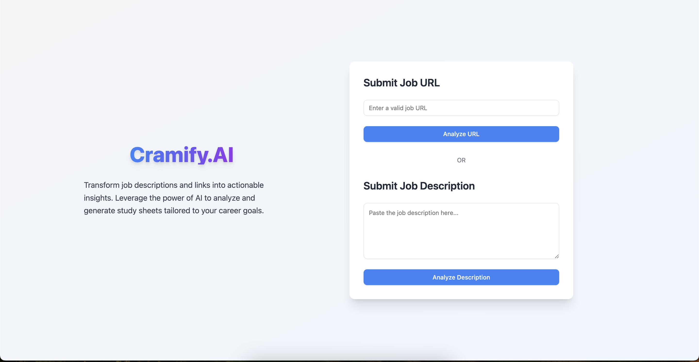
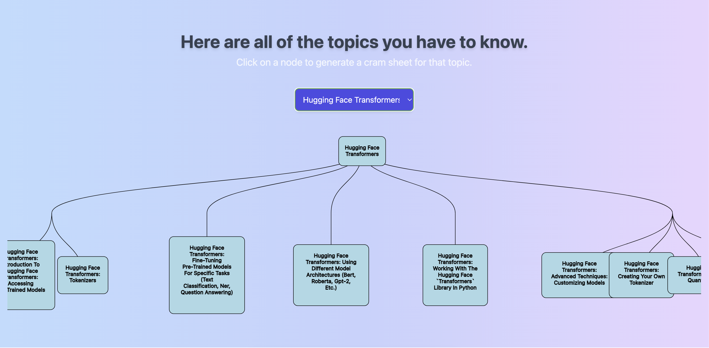
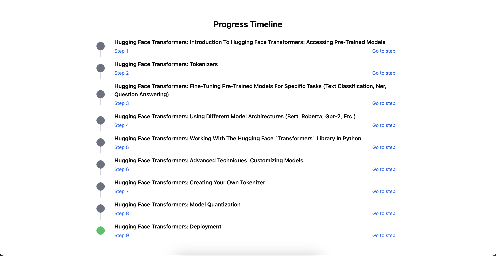
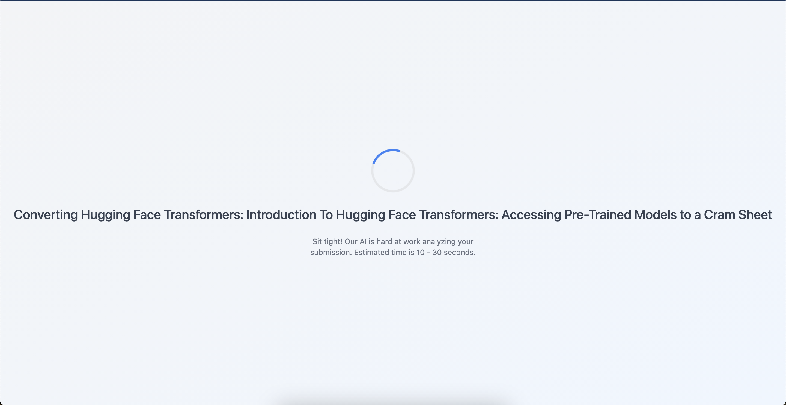

# Jobs AI 


**Jobs AI** is an AI-powered application that converts job descriptions into concise, structured cram/study sheets to help users prepare for job applications and interviews effectively.

## Features

- **AI-Powered Summarization:** Extracts key details from job descriptions, including required skills, qualifications, and responsibilities
- **Keyword Highlighting:** Emphasizes critical terms and technical requirements for easier memorization
- **Custom Templates and Roadmap:** Generates tailored study sheets to study the focus areas
- **Chronological Studying:** Provides a unique timeline from easy to difficult for each focus area
- **Job-Link Parsing:** Automatically fetches job descriptions directly from provided URLs through webscraping

## Technologies Used

- **React** and **TailwindCSS**: Frontend interface, logic, and design
- **Python** & **Flask**:  Application core logic and HTTP API call
- **BeautifulSoup** & **Selenium**: Automating web scraping
- **Redis** & **Apache Cassandra DB**: Caching data & storing data in a database 
- **Google Gemini API**: Natural language processing and text summarization.

## Preview
<p align="center" width="100%">
  
  
</p>

<p align="center" width="100%">
  
  
</p>

## Demo Video

[](https://youtu.be/eVCPKCw-nD0)

Click the image to watch the demo video on YouTube.

## Installation

1. Clone the repository:  
   ```bash
   git clone https://github.com/jasonjiang9142/WordHunter.git
   cd WordHunter
   ```

2. Build the project using the Makefile:  
   ```bash
   make
   ```

3. Run the program:  
   ```bash
   ./main
   ```

## Running Tests

The project uses **Google Test (GTest)** for testing. Follow these steps to execute the tests:

1. Navigate to the build directory:  
   ```bash
   cd build
   ```

2. Build the test suite:  
   ```bash
   make
   ```

3. Run the tests:  
   ```bash
   ctest
   ```

## How to Play

1. Launch the game:  
   ```bash
   ./main
   ```

2. Follow the on-screen prompts to choose a difficulty level and start the game.  
3. Form words by connecting adjacent letters on the grid.  
4. Submit words to earn points and try to maximize your score before time runs out.  

## Contributing

Contributions are welcome! If you’d like to improve Word Hunter, please fork the repository, make changes, and submit a pull request.  

## License

This project is licensed under the [MIT License](LICENSE).  

## Acknowledgments

- Thanks to the creators of **Google Test** for providing a robust testing framework.  
- Inspired by classic word-finding games and puzzles.
