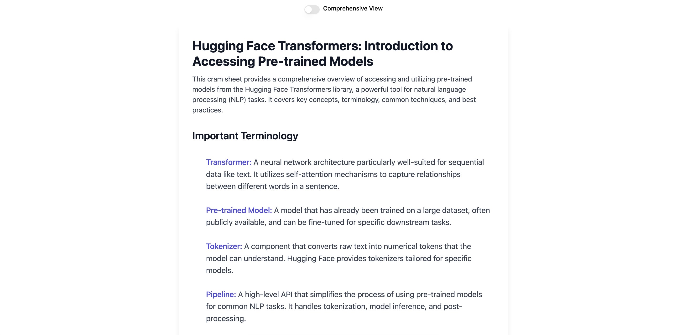
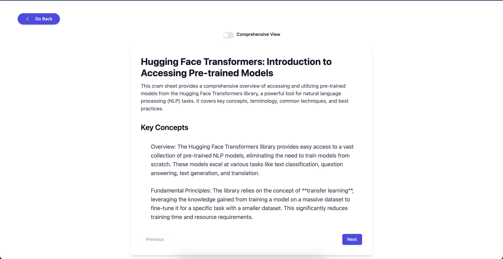

# Jobs AI 


**Jobs AI** is an AI-powered application that converts job descriptions into concise, structured cram/study sheets to help users prepare for job applications and interviews effectively.

## Features

- **AI-Powered Summarization:** Extracts key details from job descriptions, including required skills, qualifications, and responsibilities
- **Keyword Highlighting:** Emphasizes critical terms and technical requirements for easier memorization
- **Custom Templates and Roadmap:** Generates tailored study sheets to study the focus areas
- **Chronological Studying:** Provides a unique timeline from easy to difficult for each focus area
- **Job-Link Parsing:** Automatically fetches job descriptions directly from provided URLs through webscraping

## Technologies Used

- **React** and **TailwindCSS**: Frontend interface, logic, and design
- **Python** & **Flask**:  Application core logic and HTTP API call
- **BeautifulSoup** & **Selenium**: Automating web scraping
- **Redis** & **Apache Cassandra DB**: Caching data & storing data in a database 
- **Google Gemini API**: Natural language processing and text summarization.

## Preview
<p align="center" width="100%">
  
    
</p>

<p align="center" width="100%">
  
  
  
  
</p>

## Demo Video

[](https://youtu.be/eVCPKCw-nD0)

Click the image to watch the demo video on YouTube.

## Environment Variables

This project requires an **API key** for accessing the **Google Gemini API**. The key is stored securely in a `.env` file. Follow the steps below to configure your environment:

### **Setup Instructions**

1. **Create the `.env` file**  
   Copy the provided `.env.template` file and rename it to `.env`:  
   ```bash
   cp .env.template .env
2. Add Your API Key
   Open the .env file in your preferred editor and replace #your-google-api-key with your actual API key:
   ```bash
   API_KEY=your-google-api-key
   ```

   Example Configuration:
   ```bash
   API_KEY=AIzaSyEXAMPLE12345
   ```
3. Save and Close
   Make sure to save the changes before closing the file.


## Installation

1. Clone the repository:  
   ```bash
   git clone https://github.com/jasonjiang9142/jobsAI.git
   cd client
   ```

2. Install dependencies for the client and server:
   Frontend 
   ```bash
   cd client
   npm install
   npm run dev
   ```

   Backend 
   ```bash
   cd server
   pip install -r requirements.txt
   python index.py
   ```

4. Install and configure the database:
   Redis:
   ```bash
   sudo apt update
   sudo apt install redis-server
   sudo systemctl enable redis
   sudo systemctl start redis
   ```

   Apache Cassandra:
   ```bash
   sudo apt update
   sudo apt install cassandra
   sudo systemctl enable cassandra
   sudo systemctl start cassandra
   ```

   Verify installation:
   ```bash
   redis-cli ping
   cqlsh
   ```


## Contributing

Contributions are welcome! If you’d like to improve Word Hunter, please fork the repository, make changes, and submit a pull request.  

## License

This project is licensed under the [MIT License](LICENSE).  

## Acknowledgments

- Thanks to the creators of React, Flask, and TailwindCSS for providing powerful tools for development.
- Inspired by tools that help streamline the job preparation process.
